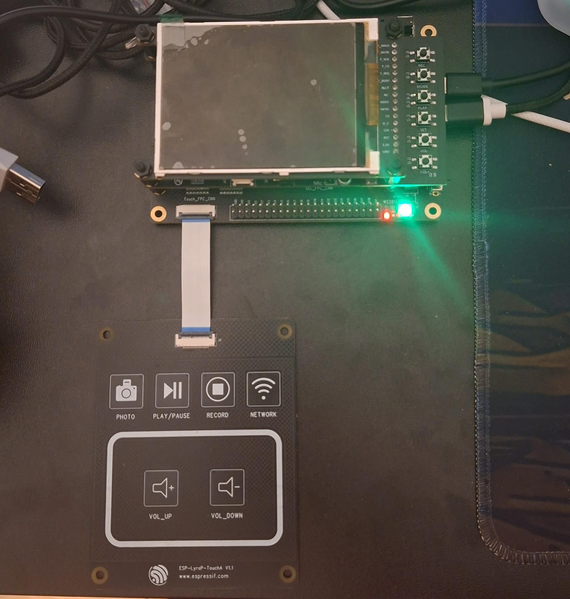
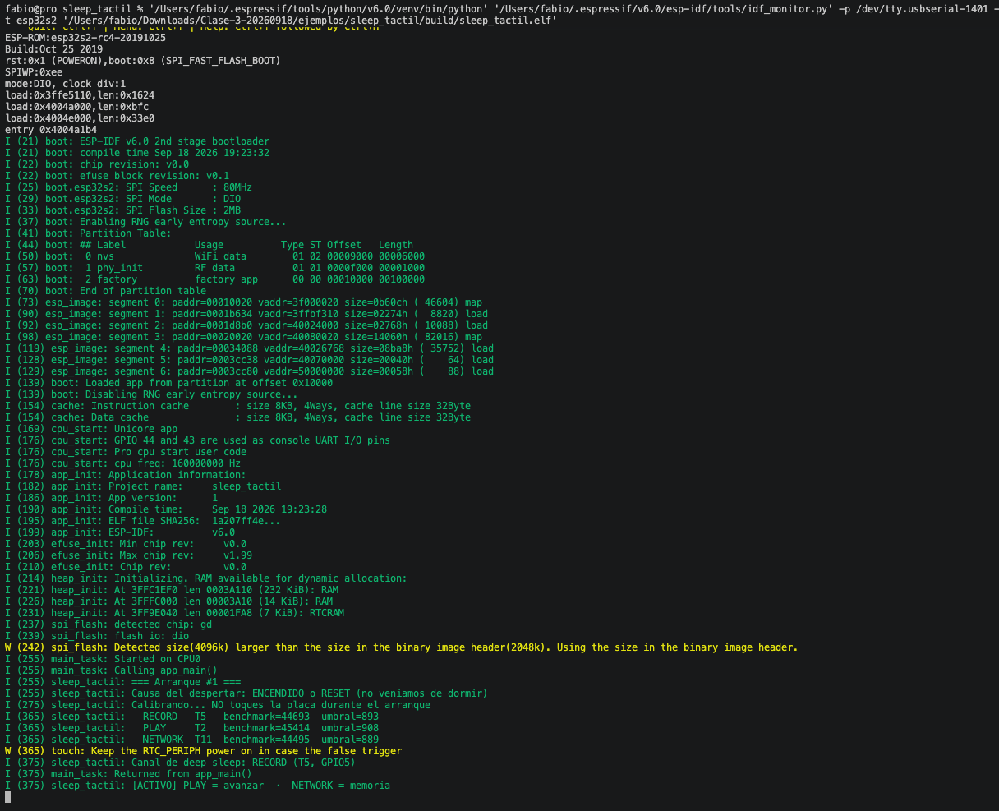
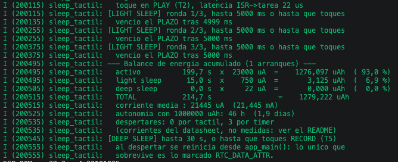
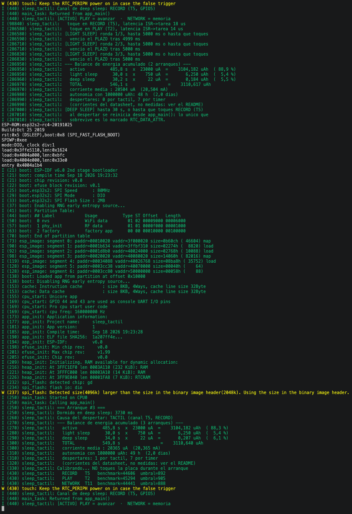
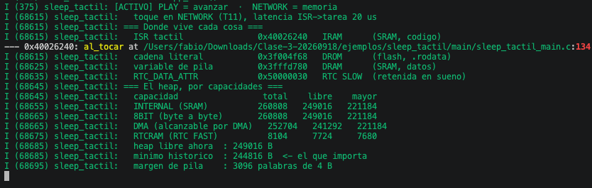

# Modos de energía - ESP32-S2 Kaluga-1

La idea del ejercicio es utilizar los tres modos de energía de la ESP32-S2: **activo**, **light sleep** y **deep sleep**.

Durante la fase activa el programa espera una acción del usuario. El botón PLAY permite avanzar a light sleep y el botón NETWORK muestra información sobre la memoria utilizada por el programa.

Después de tres rondas de light sleep la placa entra en deep sleep. Para despertarla se utiliza el botón RECORD.

## Hardware utilizado

- ESP32-S2-Kaluga-1
- Dos cables USB, uno para alimentación y otro para UART



## Botones

Los botones utilizados en el proyecto son:

| Botón | Canal | Acción |
|---|---|---|
| RECORD | T5 | Despertar del deep sleep |
| PLAY | T2 | Pasar de activo a light sleep |
| NETWORK | T11 | Mostrar información de memoria |

## Calibración

Al encender la placa se realiza una calibración automática de los sensores táctiles.

Es importante no tocar los botones mientras se está realizando la calibración.

En una de las pruebas obtuve:

| Botón | Benchmark | Umbral |
|---|---:|---:|
| RECORD | 44693 | 893 |
| PLAY | 45414 | 908 |
| NETWORK | 44495 | 889 |



## Modos de energía

El programa utiliza tres modos.

### Activo

Al iniciar, la placa queda en modo activo sin un temporizador de salida.

En este estado:

- PLAY pasa al modo light sleep.
- NETWORK muestra la información de memoria.
- Si no se toca ningún botón, la placa permanece en modo activo.

```text
[ACTIVO] PLAY = avanzar  ·  NETWORK = memoria
```

### Light sleep

Al tocar PLAY la placa entra en light sleep.

Se realizan tres rondas de hasta 5 segundos cada una. La placa puede despertar por un toque en el sensor táctil o porque se cumple el tiempo configurado.

```text
[LIGHT SLEEP] ronda 1/3, hasta 5000 ms o hasta que toques
vencio el PLAZO tras 4999 ms

[LIGHT SLEEP] ronda 2/3, hasta 5000 ms o hasta que toques
vencio el PLAZO tras 5000 ms

[LIGHT SLEEP] ronda 3/3, hasta 5000 ms o hasta que toques
vencio el PLAZO tras 5000 ms
```



### Deep sleep

Después de las tres rondas de light sleep la placa entra en deep sleep.

```text
[DEEP SLEEP] hasta 30 s, o hasta que toques RECORD (T5)
```

Al tocar RECORD, la placa se despierta y vuelve a ejecutar `app_main()`.

Durante la prueba se pudo comprobar el reinicio producido por deep sleep:

```text
rst:0x5 (DEEPSLEEP_RESET)

=== Arranque #3 ===
Dormido en deep sleep: 3730 ms
Causa del despertar: TACTIL (canal T5, RECORD)
```

El contador de arranques está almacenado utilizando `RTC_DATA_ATTR`, por lo que conserva su valor después del deep sleep.



## Memoria

Durante la fase activa se puede tocar NETWORK para mostrar información sobre la memoria.

El programa utiliza parte del ejemplo `mapa_memoria` de la clase para mostrar la región donde se encuentran distintos elementos del programa.

En la prueba se obtuvo:

```text
toque en NETWORK (T11)

=== Donde vive cada cosa ===
ISR tactil               0x40026240   IRAM      (SRAM, codigo)
cadena literal           0x3f004f68   DROM      (flash, .rodata)
variable de pila         0x3fffd780   DRAM      (SRAM, datos)
RTC_DATA_ATTR             0x50000030   RTC SLOW  (retenida en sueno)
```

También se muestra el estado del heap:

```text
=== El heap, por capacidades ===
capacidad                   total    libre    mayor
INTERNAL (SRAM)            260808   249016   221184
8BIT (byte a byte)         260808   249016   221184
DMA (alcanzable por DMA)   252704   241292   221184
RTCRAM (RTC FAST)            8104     7724     7680
```



## Consumo

Para estimar el consumo se utilizaron los valores de corriente del ESP32-S2 usados en el ejemplo de clase.

| Modo | Corriente |
|---|---:|
| Activo | 23000 µA |
| Light sleep | 750 µA |
| Deep sleep | 22 µA |

Estos valores corresponden al chip ESP32-S2 y no son una medición directa del consumo total de la placa.

El programa acumula el tiempo utilizado en cada modo y calcula una estimación del consumo.

En una de las pruebas se obtuvo:

```text
activo          485,8 s  x 23000 uA
light sleep      30,0 s  x   750 uA
deep sleep       34,0 s  x    22 uA
TOTAL           549,8 s
corriente media : 20365 uA (20,365 mA)
```

## Resultado

El programa funcionó correctamente y se pudieron comprobar los tres modos de energía.

Durante las pruebas se verificó que:

- La fase activa permanece activa hasta que se toca PLAY.
- NETWORK muestra la información de memoria sin salir de la fase activa.
- PLAY permite pasar de activo a light sleep.
- Light sleep conserva la ejecución y continúa después de despertar.
- Después de tres rondas de light sleep se entra en deep sleep.
- RECORD despierta la placa desde deep sleep.
- Después del deep sleep se vuelve a ejecutar `app_main()`.
- Las variables declaradas con `RTC_DATA_ATTR` conservan su valor después del deep sleep.

## Conclusión

Se pudieron probar los modos activo, light sleep y deep sleep de la ESP32-S2.

También se comprobó la diferencia entre light sleep y deep sleep. En light sleep el programa continúa su ejecución después de despertar, mientras que después de deep sleep la aplicación comienza nuevamente desde `app_main()`.

Además, el botón NETWORK permite consultar durante la fase activa información sobre las distintas regiones de memoria y el estado del heap.
